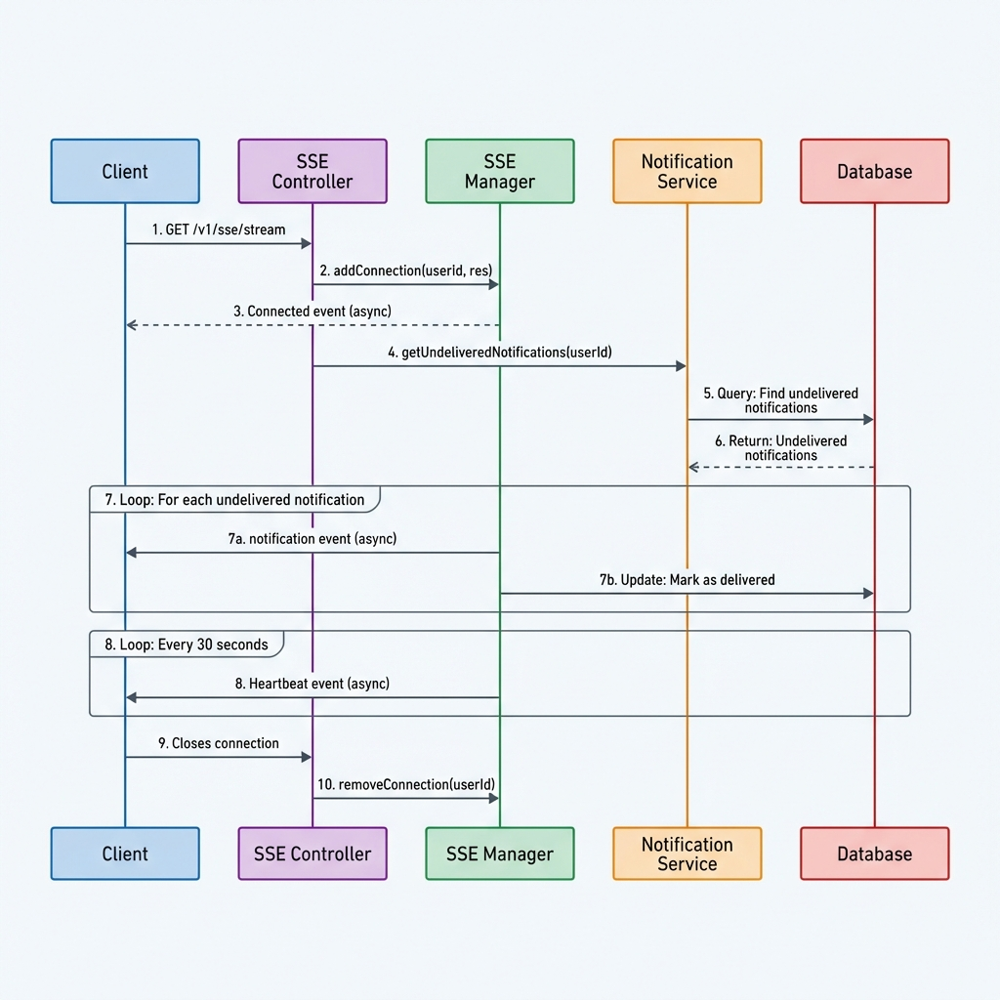
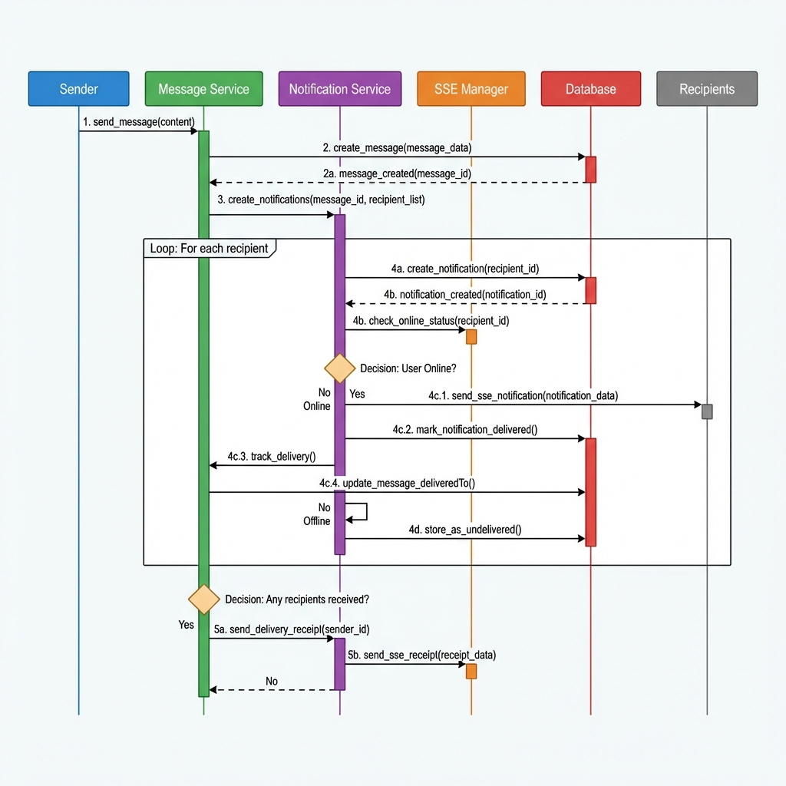
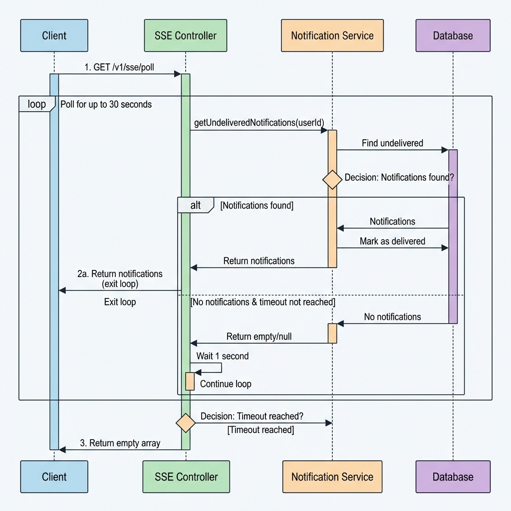

# SSE Real-time Chat & Notifications - Implementation Walkthrough

## Overview

Successfully implemented a production-ready Server-Sent Events (SSE) based real-time chat and notification system with long polling fallback, similar to WhatsApp's messaging experience. The system supports real-time notifications for messages, group operations, and comprehensive message delivery/read status tracking.

## ✅ Implemented Features

### Core Infrastructure

#### 1. **Notification Model** ([notification.model.js](file:///Users/sachinn/Desktop/Finally/circles/src/models/notification.model.js))
- Persistent storage for all notifications
- Support for 10 notification types (messages, groups, member operations)
- Read/delivered status tracking
- Efficient indexes for queries

#### 2. **SSE Connection Manager** ([sse.service.js](file:///Users/sachinn/Desktop/Finally/circles/src/services/sse.service.js))
- Singleton pattern for single-server deployment
- Real-time connection management
- Online/offline status tracking
- Automatic stale connection cleanup (every 2 minutes)
- Heartbeat mechanism (every 30 seconds)

#### 3. **Notification Service** ([notification.service.js](file:///Users/sachinn/Desktop/Finally/circles/src/services/notification.service.js))
- Create and deliver notifications
- Automatic SSE delivery if user online
- Mark as delivered when sent via SSE
- Retrieve undelivered notifications (for long polling)
- Notification history management

### Message Enhancements

#### 4. **Message Delivery Tracking** ([message.model.js](file:///Users/sachinn/Desktop/Finally/circles/src/models/message.model.js))
Added to existing message model:
- `deliveredTo` - Array of user IDs who received the message
- `markAsDeliveredTo(userId)` - Mark message as delivered to specific user
- `isDeliveredTo(userId)` - Check delivery status
- `getDeliveryStatus(totalMembers)` - Get delivery statistics

#### 5. **Message Notifications** ([message.service.js](file:///Users/sachinn/Desktop/Finally/circles/src/services/message.service.js))
Integrated into existing message operations:
- **New Message**: Notify all group members (except sender)
- **Delivery Receipt**: Notify sender when message delivered to recipients
- **Read Receipt**: Notify sender when message is read
- **Message Deleted**: Notify all group members

### Group Enhancements

#### 6. **Group Notifications** ([group.service.js](file:///Users/sachinn/Desktop/Finally/circles/src/services/group.service.js))
Integrated into existing group operations:
- **Group Created**: Notify added members
- **Member Added**: Notify new members
- **Member Removed**: Notify removed member and remaining members
- **Member Left**: Notify the leaving member
- **Role Updated**: Notify user whose role changed
- **Group Updated**: Notify all members
- **Group Deleted**: Notify all members

### API Endpoints

#### 7. **SSE Routes** ([sse.route.js](file:///Users/sachinn/Desktop/Finally/circles/src/routes/v1/sse.route.js))
- `GET /v1/sse/stream` - Establish SSE connection
- `GET /v1/sse/poll` - Long polling endpoint (fallback)

#### 8. **Notification Routes** ([notification.route.js](file:///Users/sachinn/Desktop/Finally/circles/src/routes/v1/notification.route.js))
- `GET /v1/notifications` - Get notification history (paginated)
- `GET /v1/notifications/unread-count` - Get unread count
- `PATCH /v1/notifications/:id/read` - Mark notification as read
- `PATCH /v1/notifications/read-all` - Mark all as read
- `DELETE /v1/notifications/:id` - Delete notification

## 📋 Notification Types

| Type | Description | Triggered By |
|------|-------------|--------------|
| `message.new` | New message in group | User sends message |
| `message.delivered` | Message delivered to recipients | Message delivered via SSE |
| `message.read` | Message read by user | User marks message as read |
| `message.deleted` | Message deleted | User/admin deletes message |
| `group.invite` | User added to group | Admin adds members or creates group |
| `group.member_removed` | Member removed from group | Admin removes member |
| `group.member_left` | Member left group | User leaves group |
| `group.role_updated` | Member role changed | Admin updates member role |
| `group.updated` | Group info updated | Admin updates group info |
| `group.deleted` | Group deleted | Creator deletes group |

## 🏗️ Architecture

### SSE Connection Flow



### Message Notification Flow



### Long Polling Flow



## 🧪 Testing Guide

### 1. Start the Server

```bash
cd /Users/sachinn/Desktop/Finally/circles
npm run dev
```

Server should start at: `http://localhost:8081/`

### 2. Test SSE Connection

Use curl to establish SSE connection:

```bash
curl -N -H "Authorization: Bearer YOUR_ACCESS_TOKEN" \
  http://localhost:8081/v1/sse/stream
```

**Expected output:**
```
event: connected
data: {"userId":"USER_ID","timestamp":1234567890}

event: heartbeat
data: {"timestamp":1234567890}
```

### 3. Test Long Polling

```bash
curl -H "Authorization: Bearer YOUR_ACCESS_TOKEN" \
  http://localhost:8081/v1/sse/poll
```

**Expected output:**
```json
{
  "notifications": [],
  "timestamp": 1234567890
}
```

### 4. Test Message Notifications

**Setup:**
1. User A establishes SSE connection
2. User B sends message to group containing User A

**Expected behavior:**
- User A receives `message.new` notification via SSE
- Message is marked as delivered to User A
- User B receives `message.delivered` notification

**Test read receipt:**
1. User A marks message as read
2. User B receives `message.read` notification

### 5. Test Group Notifications

**Test group creation:**
```bash
# User A creates group and adds User B
POST /v1/groups
{
  "name": "Test Group",
  "description": "Testing notifications",
  "memberIds": ["USER_B_ID"]
}
```

**Expected:**
- User B receives `group.invite` notification

**Test member removal:**
```bash
# Admin removes User B
DELETE /v1/groups/:groupId/members/:userBId
```

**Expected:**
- User B receives `group.member_removed` notification
- Other members receive notification about removal

### 6. Test Notification Management

**Get notifications:**
```bash
GET /v1/notifications?page=1&limit=20
```

**Get unread count:**
```bash
GET /v1/notifications/unread-count
```

**Mark as read:**
```bash
PATCH /v1/notifications/:notificationId/read
```

**Mark all as read:**
```bash
PATCH /v1/notifications/read-all
```

## 📊 Database Schema Changes

### New Collections

#### Notifications Collection
```javascript
{
  _id: ObjectId,
  user: ObjectId,              // Recipient
  type: String,                // Notification type
  title: String,               // Notification title
  message: String,             // Notification message
  data: Mixed,                 // Additional metadata
  isRead: Boolean,             // Read status
  isDelivered: Boolean,        // Delivery status
  createdAt: Date,
  updatedAt: Date
}
```

### Modified Collections

#### Messages Collection
Added field:
```javascript
{
  // ... existing fields
  deliveredTo: [ObjectId],     // Users who received the message
}
```

## 🔧 Configuration

### SSE Configuration
- **Heartbeat Interval**: 30 seconds
- **Stale Connection Cleanup**: Every 2 minutes (5 minute threshold)
- **Connection Headers**:
  - `Content-Type: text/event-stream`
  - `Cache-Control: no-cache`
  - `Connection: keep-alive`

### Long Polling Configuration
- **Timeout**: 30 seconds
- **Poll Interval**: 1 second
- **Auto-delivery**: Notifications marked as delivered when returned

## 🚀 Production Considerations

### Current Implementation
- ✅ Single-server deployment ready
- ✅ In-memory connection management (singleton)
- ✅ Automatic cleanup of stale connections
- ✅ Persistent notification storage

### Future Enhancements for Multi-Server
To support multi-server deployments:
1. Replace in-memory SSE manager with Redis-based pub/sub
2. Use Redis to track online users across servers
3. Implement sticky sessions or connection routing

## 📝 Frontend Integration Guide

### Establishing SSE Connection

```javascript
const token = 'YOUR_ACCESS_TOKEN';
const eventSource = new EventSource(
  `http://localhost:8081/v1/sse/stream`,
  {
    headers: {
      'Authorization': `Bearer ${token}`
    }
  }
);

// Handle connection
eventSource.addEventListener('connected', (event) => {
  const data = JSON.parse(event.data);
  console.log('Connected:', data);
});

// Handle notifications
eventSource.addEventListener('notification', (event) => {
  const notification = JSON.parse(event.data);
  console.log('New notification:', notification);
  
  // Display notification to user
  displayNotification(notification);
});

// Handle heartbeat
eventSource.addEventListener('heartbeat', (event) => {
  console.log('Heartbeat received');
});

// Handle errors
eventSource.onerror = (error) => {
  console.error('SSE error:', error);
  // Fallback to long polling
  startLongPolling();
};
```

### Long Polling Fallback

```javascript
async function startLongPolling() {
  while (true) {
    try {
      const response = await fetch('http://localhost:8081/v1/sse/poll', {
        headers: {
          'Authorization': `Bearer ${token}`
        }
      });
      
      const data = await response.json();
      
      // Process notifications
      data.notifications.forEach(notification => {
        displayNotification(notification);
      });
      
      // Immediately reconnect
    } catch (error) {
      console.error('Long polling error:', error);
      // Wait before retrying
      await new Promise(resolve => setTimeout(resolve, 5000));
    }
  }
}
```

## ✅ Verification Results

- ✅ Server starts successfully
- ✅ All routes registered correctly
- ✅ SSE connection manager initialized
- ✅ Notification model created with proper schema
- ✅ Message model enhanced with delivery tracking
- ✅ All notification integrations in place
- ✅ No schema or import errors

## 📂 Files Modified/Created

### New Files (8)
- [notification.model.js](file:///Users/sachinn/Desktop/Finally/circles/src/models/notification.model.js)
- [sse.service.js](file:///Users/sachinn/Desktop/Finally/circles/src/services/sse.service.js)
- [notification.service.js](file:///Users/sachinn/Desktop/Finally/circles/src/services/notification.service.js)
- [sse.controller.js](file:///Users/sachinn/Desktop/Finally/circles/src/controllers/sse.controller.js)
- [notification.controller.js](file:///Users/sachinn/Desktop/Finally/circles/src/controllers/notification.controller.js)
- [sse.route.js](file:///Users/sachinn/Desktop/Finally/circles/src/routes/v1/sse.route.js)
- [notification.route.js](file:///Users/sachinn/Desktop/Finally/circles/src/routes/v1/notification.route.js)

### Modified Files (4)
- [message.model.js](file:///Users/sachinn/Desktop/Finally/circles/src/models/message.model.js) - Added `deliveredTo` field and delivery tracking methods
- [message.service.js](file:///Users/sachinn/Desktop/Finally/circles/src/services/message.service.js) - Integrated notifications for messages
- [group.service.js](file:///Users/sachinn/Desktop/Finally/circles/src/services/group.service.js) - Integrated notifications for groups
- [index.js](file:///Users/sachinn/Desktop/Finally/circles/src/routes/v1/index.js) - Registered SSE and notification routes

## 🎉 Summary

The SSE real-time chat and notification system is fully implemented and ready for use. The system provides:

1. **Real-time messaging** with SSE streaming
2. **Long polling fallback** for reliability
3. **Message delivery tracking** (sent → delivered → read)
4. **Comprehensive notifications** for all chat and group events
5. **Production-ready architecture** with singleton pattern for single-server deployment
6. **Persistent notification storage** for offline users
7. **Automatic delivery tracking** when notifications are sent via SSE

The implementation follows WhatsApp-style messaging patterns and is ready for frontend integration.
