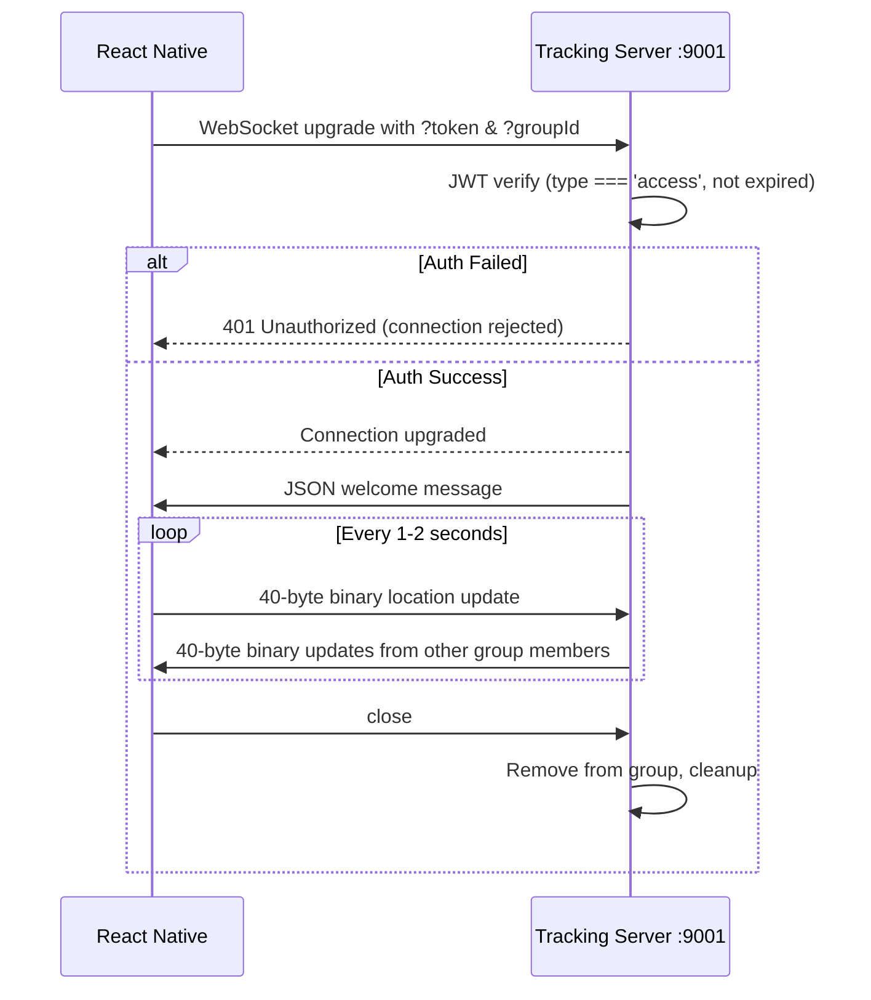

# Tracking Engine — React Native Integration Guide

Complete reference for integrating the **real-time location tracking WebSocket server** into the React Native (Expo) frontend.

---

## 1. Server Architecture Overview

| Component | Port | Protocol | Purpose |
|-----------|------|----------|---------|
| **Express REST API** | `8082` | HTTP | Auth, groups, trips, notifications |
| **Tracking Server** | `9001` | WebSocket (binary) | Real-time location relay |
| **SSE** | `8082` `/v1/sse/stream` | HTTP (text/event-stream) | Notifications & chat events |

Both servers share the **same `JWT_SECRET`**, so access tokens obtained via the REST API work directly with the tracking server.

---

## 2. Authentication (Prerequisite)

### 2.1 Login — `POST /v1/auth/social-login`

```
URL:  http://<API_HOST>:8082/v1/auth/social-login
Method: POST
Content-Type: application/json
```

**Request Body:**
```json
{
  "provider": "google",
  "socialId": "google-oauth-id-string",
  "email": "rider@email.com",
  "fName": "Sachin",
  "lName": "Negali"
}
```

**Response (200):**
```json
{
  "user": {
    "_id": "65a1b2c3d4e5f6a7b8c9d0e1",
    "fName": "Sachin",
    "lName": "Negali",
    "email": "rider@email.com",
    "socialAccounts": [{ "provider": "google", "id": "google-oauth-id-string" }]
  },
  "tokens": {
    "access": {
      "token": "eyJhbGciOiJIUzI1NiIsInR5cCI6IkpXVCJ9...",
      "expires": "2026-03-04T03:43:38.000Z"
    },
    "refresh": {
      "token": "eyJhbGciOiJIUzI1NiIsInR5cCI6IkpXVCJ9...",
      "expires": "2026-04-03T03:13:38.000Z"
    }
  }
}
```

> [!IMPORTANT]
> The `access.token` is what you pass to the tracking server. It expires in **30 minutes**. Use the refresh endpoint before connecting if the token is about to expire.

### 2.2 Refresh Token — `POST /v1/auth/refresh-tokens`

```
URL:  http://<API_HOST>:8082/v1/auth/refresh-tokens
Method: POST
Content-Type: application/json
```

**Request Body:**
```json
{
  "refreshToken": "<refresh-token-string>"
}
```

**Response (200):**
```json
{
  "access": {
    "token": "eyJhbGciO...",
    "expires": "2026-03-04T04:13:38.000Z"
  },
  "refresh": {
    "token": "eyJhbGciO...",
    "expires": "2026-04-03T03:43:38.000Z"
  }
}
```

### 2.3 JWT Token Payload Structure

```typescript
interface JWTPayload {
  sub: string;   // MongoDB User _id
  iat: number;   // Issued at (unix seconds)
  exp: number;   // Expiry (unix seconds)
  type: 'access' | 'refresh';
}
```

> [!CAUTION]
> The tracking server **rejects** tokens where `type !== 'access'`. Never pass a refresh token.

---

## 3. Groups & Trips (Context for `groupId`)

The `groupId` you pass to the tracking server is a **MongoDB `_id`** of a Group or a Trip. All members of that group/trip can see each other's live locations.

### 3.1 Get User Groups — `GET /v1/group`

```
URL:     http://<API_HOST>:8082/v1/group
Method:  GET
Headers: Authorization: Bearer <access-token>
```

**Response (200):**
```json
[
  {
    "_id": "65f1a2b3c4d5e6f7a8b9c0d1",
    "name": "Sunday Riders",
    "members": [
      { "user": "65a1b2c3...", "role": "admin", "joinedAt": "..." },
      { "user": "65a1b2c4...", "role": "member", "joinedAt": "..." }
    ],
    "isActive": true
  }
]
```

### 3.2 Get User Trips — `GET /v1/trip`

```
URL:     http://<API_HOST>:8082/v1/trip
Method:  GET
Headers: Authorization: Bearer <access-token>
```

---

## 4. WebSocket Connection (Tracking Server)

### 4.1 Endpoint

```
ws://<TRACKING_HOST>:9001/?token=<ACCESS_TOKEN>&groupId=<GROUP_OR_TRIP_ID>
```

| Param | Type | Required | Description |
|-------|------|----------|-------------|
| `token` | string | ✅ | JWT access token (type: `access`) |
| `groupId` | string | ✅ | MongoDB `_id` of the group/trip being tracked |

### 4.2 Connection Lifecycle



### 4.3 Welcome Message (received on open)

```json
{
  "type": "welcome",
  "userId": "65a1b2c3d4e5f6a7b8c9d0e1",
  "groupId": "65f1a2b3c4d5e6f7a8b9c0d1",
  "groupSize": 3,
  "timestamp": 1741045418000
}
```

### 4.4 Health Check (HTTP)

```
GET http://<TRACKING_HOST>:9001/health
```

Response:
```json
{ "status": "ok", "groups": 5, "timestamp": 1741045418000 }
```

---

## 5. Binary Protocol — 40-Byte Location Message

### 5.1 Wire Format

| Offset | Type | Size (bytes) | Description |
|--------|------|------|-------------|
| 0 | `uint32` | 4 | User ID (numeric) |
| 4 | `float64` | 8 | Latitude |
| 12 | `float64` | 8 | Longitude |
| 20 | `uint16` | 2 | Speed (km/h) |
| 22 | `uint16` | 2 | Bearing (degrees, 0–360) |
| 24 | `uint8` | 1 | Status code |
| 25 | `uint64` | 8 | Timestamp (ms since epoch) |
| 33 | reserved | 7 | Padding (zeroed) |
| **Total** | | **40** | |

### 5.2 Status Codes

| Code | Meaning |
|------|---------|
| `0` | Idle / Stopped |
| `1` | Active / Moving |
| `2` | Paused |
| `3` | SOS / Emergency |

### 5.3 User ID Mapping

The binary protocol uses a **numeric** user ID (`uint32`). Since your backend uses MongoDB ObjectId strings, you need a deterministic mapping:

```typescript
/**
 * Convert MongoDB ObjectId to a numeric userId for the binary protocol.
 * Uses the last 4 bytes of the ObjectId hex string.
 */
function objectIdToNumericId(objectId: string): number {
  // Take last 8 hex chars (4 bytes) → fits in uint32
  return parseInt(objectId.slice(-8), 16);
}
```

---

## 6. TypeScript Types

```typescript
// ─── Auth ───
interface AuthTokens {
  access: { token: string; expires: string };
  refresh: { token: string; expires: string };
}

interface User {
  _id: string;
  fName: string;
  lName: string;
  email: string;
  socialAccounts: { provider: 'google'; id: string }[];
  createdAt: string;
  updatedAt: string;
}

interface AuthResponse {
  user: User;
  tokens: AuthTokens;
}

// ─── Groups ───
interface GroupMember {
  user: string; // User _id
  role: 'admin' | 'member';
  joinedAt: string;
}

interface Group {
  _id: string;
  name: string;
  description?: string;
  avatar?: string | null;
  createdBy: string;
  members: GroupMember[];
  isActive: boolean;
  settings: {
    onlyAdminsCanMessage: boolean;
    onlyAdminsCanEditInfo: boolean;
    maxMembers: number;
  };
}

// ─── Tracking ───
interface LocationUpdate {
  userId: number;     // uint32 numeric id
  lat: number;        // float64
  lng: number;        // float64
  speed: number;      // uint16 km/h
  bearing: number;    // uint16 degrees
  status: number;     // uint8 status code
  timestamp: number;  // uint64 ms epoch
}

interface WelcomeMessage {
  type: 'welcome';
  userId: string;
  groupId: string;
  groupSize: number;
  timestamp: number;
}

type TrackingServerMessage = WelcomeMessage | LocationUpdate;

// ─── Connection Config ───
interface TrackingConfig {
  wsUrl: string;            // e.g., "ws://localhost:9001"
  accessToken: string;
  groupId: string;
  updateIntervalMs: number; // default: 1000–2000
}
```

---

## 7. React Native Implementation

### 7.1 Binary Encoder / Decoder

```typescript
// src/services/tracking/binaryProtocol.ts

const LOCATION_MSG_SIZE = 40;

export function encodeLocationUpdate(
  userId: number,
  lat: number,
  lng: number,
  speed: number,
  bearing: number,
  status: number
): ArrayBuffer {
  const buffer = new ArrayBuffer(LOCATION_MSG_SIZE);
  const view = new DataView(buffer);

  view.setUint32(0, userId, true);         // LE
  view.setFloat64(4, lat, true);           // LE
  view.setFloat64(12, lng, true);          // LE
  view.setUint16(20, speed, true);         // LE
  view.setUint16(22, bearing, true);       // LE
  view.setUint8(24, status);

  // Timestamp as two uint32s (JS doesn't have native BigInt in DataView)
  const now = Date.now();
  view.setUint32(25, now & 0xFFFFFFFF, true);       // low 32
  view.setUint32(29, Math.floor(now / 0x100000000), true); // high 32

  // Bytes 33–39 are reserved (already zero in a new ArrayBuffer)
  return buffer;
}

export function decodeLocationUpdate(buffer: ArrayBuffer): LocationUpdate {
  if (buffer.byteLength !== LOCATION_MSG_SIZE) {
    throw new Error(`Invalid message size: ${buffer.byteLength}, expected ${LOCATION_MSG_SIZE}`);
  }

  const view = new DataView(buffer);

  const low = view.getUint32(25, true);
  const high = view.getUint32(29, true);
  const timestamp = high * 0x100000000 + low;

  return {
    userId: view.getUint32(0, true),
    lat: view.getFloat64(4, true),
    lng: view.getFloat64(12, true),
    speed: view.getUint16(20, true),
    bearing: view.getUint16(22, true),
    status: view.getUint8(24),
    timestamp,
  };
}
```

### 7.2 `useTracking` Hook

```typescript
// src/hooks/useTracking.ts

import { useRef, useState, useCallback, useEffect } from 'react';
import * as Location from 'expo-location';
import { AppState, AppStateStatus } from 'react-native';
import { encodeLocationUpdate, decodeLocationUpdate } from '../services/tracking/binaryProtocol';

interface PeerLocation extends LocationUpdate {
  receivedAt: number;
}

interface UseTrackingOptions {
  wsUrl: string;                  // "ws://<HOST>:9001"
  accessToken: string;
  groupId: string;
  numericUserId: number;          // from objectIdToNumericId()
  updateIntervalMs?: number;      // default 2000
  enabled?: boolean;              // default true
}

interface UseTrackingReturn {
  isConnected: boolean;
  peerLocations: Map<number, PeerLocation>;
  myLocation: Location.LocationObject | null;
  groupSize: number;
  error: string | null;
  connect: () => void;
  disconnect: () => void;
}

export function useTracking(options: UseTrackingOptions): UseTrackingReturn {
  const {
    wsUrl,
    accessToken,
    groupId,
    numericUserId,
    updateIntervalMs = 2000,
    enabled = true,
  } = options;

  const wsRef = useRef<WebSocket | null>(null);
  const intervalRef = useRef<NodeJS.Timeout | null>(null);
  const reconnectTimeoutRef = useRef<NodeJS.Timeout | null>(null);
  const reconnectAttempts = useRef(0);

  const [isConnected, setIsConnected] = useState(false);
  const [peerLocations, setPeerLocations] = useState<Map<number, PeerLocation>>(new Map());
  const [myLocation, setMyLocation] = useState<Location.LocationObject | null>(null);
  const [groupSize, setGroupSize] = useState(0);
  const [error, setError] = useState<string | null>(null);

  // ─── Connect ───
  const connect = useCallback(() => {
    if (wsRef.current?.readyState === WebSocket.OPEN) return;

    const url = `${wsUrl}/?token=${encodeURIComponent(accessToken)}&groupId=${encodeURIComponent(groupId)}`;
    const ws = new WebSocket(url);
    ws.binaryType = 'arraybuffer';

    ws.onopen = () => {
      setIsConnected(true);
      setError(null);
      reconnectAttempts.current = 0;
      startLocationUpdates(ws);
    };

    ws.onmessage = (event: MessageEvent) => {
      if (event.data instanceof ArrayBuffer && event.data.byteLength === 40) {
        // Binary location update from peer
        const update = decodeLocationUpdate(event.data);
        setPeerLocations(prev => {
          const next = new Map(prev);
          next.set(update.userId, { ...update, receivedAt: Date.now() });
          return next;
        });
      } else if (typeof event.data === 'string') {
        // JSON control message (welcome, etc.)
        try {
          const msg = JSON.parse(event.data);
          if (msg.type === 'welcome') {
            setGroupSize(msg.groupSize);
          }
        } catch { /* ignore parse errors */ }
      }
    };

    ws.onerror = () => {
      setError('WebSocket connection error');
    };

    ws.onclose = (event) => {
      setIsConnected(false);
      stopLocationUpdates();

      // Auto-reconnect with exponential backoff
      if (enabled) {
        const delay = Math.min(1000 * 2 ** reconnectAttempts.current, 30000);
        reconnectTimeoutRef.current = setTimeout(() => {
          reconnectAttempts.current++;
          connect();
        }, delay);
      }
    };

    wsRef.current = ws;
  }, [wsUrl, accessToken, groupId, enabled]);

  // ─── Disconnect ───
  const disconnect = useCallback(() => {
    if (reconnectTimeoutRef.current) {
      clearTimeout(reconnectTimeoutRef.current);
    }
    stopLocationUpdates();
    wsRef.current?.close();
    wsRef.current = null;
    setIsConnected(false);
  }, []);

  // ─── Location Updates ───
  const startLocationUpdates = useCallback(async (ws: WebSocket) => {
    const { status } = await Location.requestForegroundPermissionsAsync();
    if (status !== 'granted') {
      setError('Location permission denied');
      return;
    }

    intervalRef.current = setInterval(async () => {
      try {
        const loc = await Location.getCurrentPositionAsync({
          accuracy: Location.Accuracy.BestForNavigation,
        });
        setMyLocation(loc);

        if (ws.readyState === WebSocket.OPEN) {
          const msg = encodeLocationUpdate(
            numericUserId,
            loc.coords.latitude,
            loc.coords.longitude,
            Math.round((loc.coords.speed ?? 0) * 3.6), // m/s → km/h
            Math.round(loc.coords.heading ?? 0),
            1 // status: active
          );
          ws.send(msg);
        }
      } catch (err) {
        console.warn('[Tracking] Location error:', err);
      }
    }, updateIntervalMs);
  }, [numericUserId, updateIntervalMs]);

  const stopLocationUpdates = useCallback(() => {
    if (intervalRef.current) {
      clearInterval(intervalRef.current);
      intervalRef.current = null;
    }
  }, []);

  // ─── AppState handling: pause in background ───
  useEffect(() => {
    const sub = AppState.addEventListener('change', (state: AppStateStatus) => {
      if (state === 'active' && enabled) {
        connect();
      } else if (state === 'background') {
        disconnect();
      }
    });
    return () => sub.remove();
  }, [connect, disconnect, enabled]);

  // ─── Auto connect/disconnect ───
  useEffect(() => {
    if (enabled) connect();
    return () => disconnect();
  }, [enabled, connect, disconnect]);

  return {
    isConnected,
    peerLocations,
    myLocation,
    groupSize,
    error,
    connect,
    disconnect,
  };
}
```

### 7.3 Usage in a Screen

```tsx
// src/screens/LiveTrackingScreen.tsx

import React from 'react';
import { View, Text } from 'react-native';
import MapView, { Marker } from 'react-native-maps';
import { useTracking } from '../hooks/useTracking';
import { useSelector } from 'react-redux';

function objectIdToNumericId(objectId: string): number {
  return parseInt(objectId.slice(-8), 16);
}

export default function LiveTrackingScreen({ route }) {
  const { groupId } = route.params;
  const { accessToken, user } = useSelector((state) => state.auth);

  const {
    isConnected,
    peerLocations,
    myLocation,
    groupSize,
    error,
  } = useTracking({
    wsUrl: 'ws://YOUR_SERVER_IP:9001',
    accessToken,
    groupId,
    numericUserId: objectIdToNumericId(user._id),
    updateIntervalMs: 2000,
  });

  return (
    <View style={{ flex: 1 }}>
      {/* Status Bar */}
      <View style={{ padding: 8, backgroundColor: isConnected ? '#4CAF50' : '#F44336' }}>
        <Text style={{ color: '#fff', textAlign: 'center' }}>
          {isConnected ? `🟢 Connected — ${groupSize} riders` : '🔴 Disconnected'}
        </Text>
        {error && <Text style={{ color: '#fff' }}>{error}</Text>}
      </View>

      {/* Map */}
      <MapView
        style={{ flex: 1 }}
        region={myLocation ? {
          latitude: myLocation.coords.latitude,
          longitude: myLocation.coords.longitude,
          latitudeDelta: 0.01,
          longitudeDelta: 0.01,
        } : undefined}
      >
        {/* My marker */}
        {myLocation && (
          <Marker
            coordinate={{
              latitude: myLocation.coords.latitude,
              longitude: myLocation.coords.longitude,
            }}
            title="You"
            pinColor="blue"
          />
        )}

        {/* Peer markers */}
        {[...peerLocations.values()].map((peer) => (
          <Marker
            key={peer.userId}
            coordinate={{ latitude: peer.lat, longitude: peer.lng }}
            title={`Rider ${peer.userId}`}
            description={`${peer.speed} km/h | ${peer.bearing}°`}
            pinColor="red"
          />
        ))}
      </MapView>
    </View>
  );
}
```

---

## 8. REST API Endpoints Quick Reference

All REST endpoints use `http://<API_HOST>:8082` with `Authorization: Bearer <access-token>` header.

### Auth
| Method | Endpoint | Body | Auth |
|--------|----------|------|------|
| `POST` | `/v1/auth/social-login` | `{ provider, socialId, email, fName, lName }` | ❌ |
| `POST` | `/v1/auth/refresh-tokens` | `{ refreshToken }` | ❌ |

### Groups
| Method | Endpoint | Body | Auth |
|--------|----------|------|------|
| `POST` | `/v1/group` | `{ name, description? }` | ✅ |
| `GET` | `/v1/group` | — | ✅ |
| `GET` | `/v1/group/:id` | — | ✅ (member) |
| `PATCH` | `/v1/group/:id` | `{ name?, description? }` | ✅ (member) |
| `DELETE` | `/v1/group/:id` | — | ✅ (creator) |
| `POST` | `/v1/group/:id/members` | `{ userIds: string[] }` | ✅ (admin) |
| `DELETE` | `/v1/group/:id/members/:userId` | — | ✅ (member) |
| `PATCH` | `/v1/group/:id/members/:userId/role` | `{ role }` | ✅ (admin) |
| `POST` | `/v1/group/:id/leave` | — | ✅ (member) |

### Trips
| Method | Endpoint | Body | Auth |
|--------|----------|------|------|
| `POST` | `/v1/trip` | `{ title, description?, startLocation, destination, stops?, startDate, endDate }` | ✅ |
| `GET` | `/v1/trip` | — | ✅ |
| `GET` | `/v1/trip/:id` | — | ✅ |
| `PATCH` | `/v1/trip/:id` | partial trip fields | ✅ |
| `DELETE` | `/v1/trip/:id` | — | ✅ |
| `POST` | `/v1/trip/:id/participants` | `{ userIds: string[] }` | ✅ |
| `DELETE` | `/v1/trip/:id/participants/:userId` | — | ✅ |

### SSE (Notifications)
| Method | Endpoint | Auth |
|--------|----------|------|
| `GET` | `/v1/sse/stream` | ✅ |
| `GET` | `/v1/sse/poll` | ✅ |

### Tracking Server (WebSocket)
| Protocol | Endpoint | Auth |
|----------|----------|------|
| `ws://` | `:9001/?token=<jwt>&groupId=<id>` | Query param JWT |
| `GET` | `:9001/health` | ❌ |

---

## 9. Key Implementation Notes

> [!TIP]
> **Binary vs JSON**: The tracking server uses a binary protocol for location messages to minimize GC pressure and maximize throughput. JSON is only used for the initial welcome message.

> [!WARNING]
> **Token Expiry**: Access tokens expire in **30 minutes**. Before connecting to the tracking server, check token expiry and refresh if needed. The tracking server will **reject** WebSocket upgrades with expired tokens (no in-flight refresh).

> [!IMPORTANT]
> **Numeric User ID**: The binary protocol uses `uint32` for user IDs, but your database uses MongoDB ObjectId strings. Use `objectIdToNumericId()` for mapping. Ensure all clients in the same group use the same mapping function so they can identify each other.

### Reconnection Strategy
- Exponential backoff: `1s → 2s → 4s → 8s → ... → 30s max`
- Reset backoff counter on successful connection
- Pause tracking when app goes to background
- Resume when app returns to foreground

### Required Permissions (Expo)
```json
// app.json
{
  "expo": {
    "ios": {
      "infoPlist": {
        "NSLocationWhenInUseUsageDescription": "Show your position on the group ride map",
        "NSLocationAlwaysAndWhenInUseUsageDescription": "Track your ride in the background"
      }
    },
    "android": {
      "permissions": [
        "ACCESS_FINE_LOCATION",
        "ACCESS_COARSE_LOCATION",
        "FOREGROUND_SERVICE"
      ]
    }
  }
}
```

### Required Packages
```bash
npx expo install expo-location react-native-maps
```
